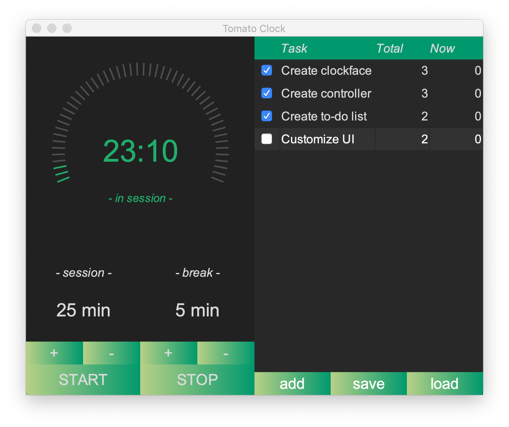

# :tomato: **Tomato Clock**

>  A *Java Swing* app made with :heart: and :coffee:

## Key features

- **Digital clock face**: with animated ticks, mode and remaining time indicator
- **Control unit**: feel free to pause, resume or adjust your session at any time
- **To-do list**: manage your tasks and allocate sessions 
- **Profile save**: save your tasks to local files

## How did we create it?

- Customized UI by tweaking renderer of Java swing components 
- Multi-threading supports real time adjustments to your sessions when you click buttons
- Designed our clock face with JPanel and Java's 2D graphics 

